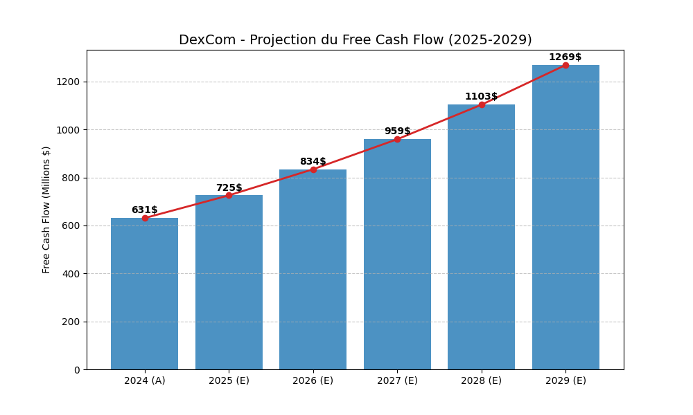
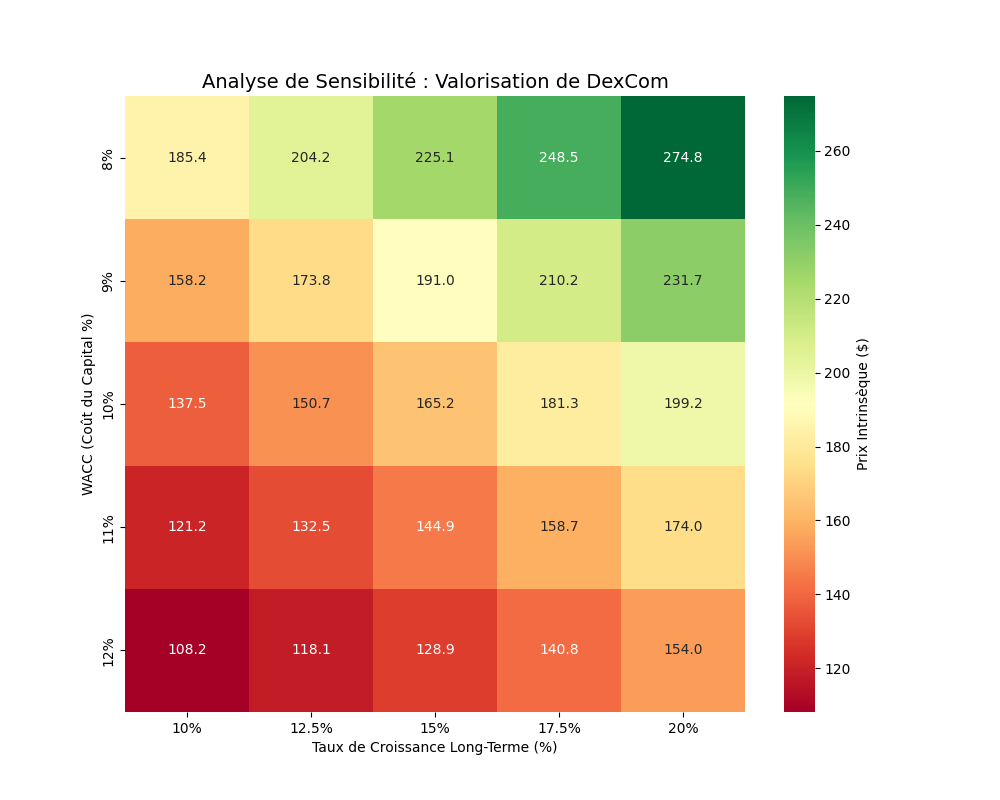

# Analyse-Quantamentale-Focus-Gestion-de-Conviction
Ce projet combine l'automatisation de la donnée financière et l'analyse fondamentale de conviction. À partir d'un univers de 500 actions, j'ai développé un algorithme de screening pour identifier les leaders de croissance, avant de réaliser une évaluation intrinsèque complète de la société DexCom.

Ce projet propose une méthodologie hybride de sélection d'actifs, combinant la puissance de calcul de **Python** et la rigueur de l'**Analyse Fondamentale**.

##  Objectif du Projet
L'objectif est d'identifier une valeur de croissance "Quality" au sein du S&P 500 Healthcare et d'en déterminer la valeur intrinsèque via un modèle de flux de trésorerie actualisés (DCF).

---

##  Étape 1 : Screening Quantitatif (Python)
J'ai développé un script pour filtrer l'univers du secteur de la santé selon des critères de rentabilité stricts :
* **ROE > 30%**
* **Marge Opérationnelle > 20%**
* **Stabilité du Bilan**

**Résultat :** DexCom a été sélectionnée pour sa position de leader technologique et sa rentabilité exceptionnelle.

---

##  Étape 2 : Analyse Fondamentale (Rapport 10-K)
L'étude du rapport annuel 2024 a permis de valider deux points clés :
1. **L'Avantage Compétitif (Moat) :** Un écosystème "captif" reliant patients, médecins et dispositifs tiers.
2. **Solidité Financière :** Une position de **Net Cash** permettant de financer la R&D sans dépendre du crédit.

---

##  Étape 3 : Valorisation & Visualisations
Le modèle DCF a été construit sur une hypothèse de croissance annuelle de 15% du Free Cash Flow.

### A. Projection des Flux (2025-2029)
On observe ici la trajectoire de croissance attendue pour les 5 prochaines années.

### B. Analyse de Sensibilité
Ce graphique illustre l'impact des variations du coût du capital (WACC) et de la croissance sur le prix intrinsèque de l'action.

